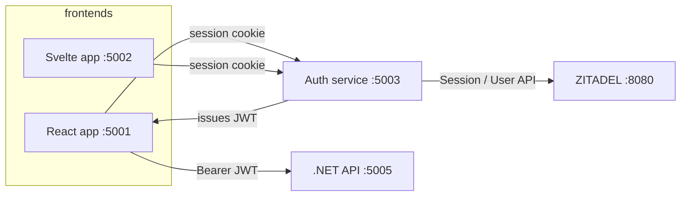

# ZITADEL Multi-App Demo

A local demo stack that shows how two frontend apps share one auth service backed by [ZITADEL](https://zitadel.com). The auth service handles login, session cookies, JWT issuance, and admin user management. A .NET API validates those JWTs for the React app.

## Architecture

| Service | Path | URL | Purpose |
|---------|------|-----|---------|
| ZITADEL | `zitadel-compose/` | http://localhost:8080 | Identity provider |
| Auth service | `/` (repo root) | http://localhost:5003 | Login, sessions, JWTs, user admin |
| React app | `app1/` | http://localhost:5001 | Frontend that calls the .NET API |
| SvelteKit app | `app2/` | http://localhost:5002 | Frontend that uses auth sessions only |
| .NET API | `app1api/` | http://localhost:5005 | Protected API for the React app |



## Prerequisites

Install these before you start:

- [Docker](https://docs.docker.com/get-docker/) and Docker Compose
- [Node.js](https://nodejs.org/) 18 or newer (20+ recommended)
- [.NET SDK 10](https://dotnet.microsoft.com/download) (for `app1api`)

Verify your setup:

```sh
docker --version
node --version
npm --version
dotnet --version
```

## 1. Start ZITADEL

```sh
cd zitadel-compose
cp .env.example .env
docker compose --env-file .env up -d --wait
```

Wait until all services are healthy. ZITADEL should be available at http://localhost:8080.

Default admin login (created on first startup):

- **Username:** `zitadel-admin@zitadel.localhost`
- **Password:** `Password1!`

## 2. Create a ZITADEL service account token

The auth service calls ZITADEL APIs (sessions, users, password reset) with a Personal Access Token (PAT).

1. Open http://localhost:8080 and sign in as the admin user above.
2. Go to **Users → Service Users → New**.
3. Create a service user with **Bearer** as the access token type.
4. Open the new user, go to **Personal Access Tokens → New**, and copy the token immediately.
5. Grant the service user permissions to manage users and sessions. For local development, assigning an org-level **Org Owner** or instance-level **IAM Owner** role is the simplest option.

## 3. Configure environment variables

Generate a shared signing secret for JWTs. Use the same value in the auth service and the .NET API:

```sh
openssl rand -base64 32
```

### Auth service (repo root)

```sh
cp example.env .env
```

Edit `.env`:

```env
ZITADEL_ISSUER=http://localhost:8080
ZITADEL_SERVICE_ACCOUNT_TOKEN=<paste-your-pat-here>
AUTH_SECRET=<paste-the-generated-secret-here>
```

### React app

```sh
cp app1/example.env app1/.env
```

The defaults are already correct for local testing:

```env
VITE_AUTH_ORIGIN=http://localhost:5003
VITE_APP_ORIGIN=http://localhost:5001
VITE_API_ORIGIN=http://localhost:5005
```

### SvelteKit app

```sh
cp app2/example.env app2/.env
```

```env
VITE_AUTH_ORIGIN=http://localhost:5003
VITE_APP_ORIGIN=http://localhost:5002
```

### .NET API

The API reads `Auth:Secret` and must use the **same value** as `AUTH_SECRET` in the auth service.

Option A — environment variable when running:

```sh
Auth__Secret=<same-value-as-AUTH_SECRET> dotnet run
```

Option B — user secrets (recommended for local dev):

```sh
cd app1api
dotnet user-secrets set "Auth:Secret" "<same-value-as-AUTH_SECRET>"
```

## 4. Install dependencies

From the repo root:

```sh
npm install
npm install --prefix app1
npm install --prefix app2
dotnet restore app1api/App1Api.csproj
```

## 5. Run all services

Open **five terminals** and start each service on its expected port:

**Terminal 1 — ZITADEL** (if not already running):

```sh
cd zitadel-compose
docker compose --env-file .env up
```

**Terminal 2 — Auth service:**

```sh
npm run dev -- --port 5003
```

**Terminal 3 — React app:**

```sh
npm run dev --prefix app1 -- --port 5001
```

**Terminal 4 — SvelteKit app:**

```sh
npm run dev --prefix app2 -- --port 5002
```

**Terminal 5 — .NET API:**

```sh
cd app1api
Auth__Secret=<your-auth-secret> dotnet run
```

## 6. Test the application

### Auth service (http://localhost:5003)

1. Open http://localhost:5003/login
2. Sign in with `zitadel-admin@zitadel.localhost` / `Password1!`
3. On the home page, confirm you are signed in.
4. As admin, create, list, and edit users from the home page.
5. Try **Forgot password?** on the login page to exercise the reset flow.

### React app (http://localhost:5001)

1. Open http://localhost:5001
2. Click **Login** — you should be redirected to the auth service and back after sign-in.
3. Click **Call API** on the dashboard.
4. Confirm the response includes your email and `isAdmin: true` for the default admin user.

### SvelteKit app (http://localhost:5002)

1. Open http://localhost:5002
2. Click **Login** and complete the same auth flow.
3. Confirm the welcome message shows your signed-in user.
4. Click **Logout** and confirm you return to an unauthenticated state.

### .NET API directly (optional)

After signing in through the React app (or auth service), fetch a JWT and call the API:

```sh
# Get a JWT (requires an active browser session cookie from localhost:5003)
curl -s http://localhost:5003/api/token \
  --cookie "authjs.session-token=<your-session-cookie>" | jq

# Call the protected endpoint
curl -s http://localhost:5005/api/hello \
  -H "Authorization: Bearer <accessToken>" | jq
```

Expected `/api/hello` response shape:

```json
{
  "message": "Hello zitadel-admin@zitadel.localhost",
  "userId": "...",
  "isAdmin": true
}
```

## Troubleshooting

| Problem | What to check |
|---------|----------------|
| Login fails with "incorrect username or password" | ZITADEL is running at http://localhost:8080 and `ZITADEL_SERVICE_ACCOUNT_TOKEN` is set correctly in `.env` |
| Admin user management is empty or actions fail | The service account PAT needs user-management permissions (Org Owner / IAM Owner for local dev) |
| React **Call API** returns 401 or 500 | `AUTH_SECRET` (auth service) and `Auth:Secret` (.NET API) must match exactly |
| CORS or redirect errors | Apps must run on ports **5001**, **5002**, and **5003** as documented above |
| `Auth:Secret is missing` when starting the API | Set `Auth__Secret` or use `dotnet user-secrets` as shown in step 3 |

## Project structure

```
.
├── src/                 # Auth service (SvelteKit + Auth.js)
├── app1/                # React frontend
├── app2/                # SvelteKit frontend
├── app1api/             # .NET JWT-protected API
└── zitadel-compose/     # Local ZITADEL stack (Docker Compose)
```

## Useful commands

```sh
# Type-check the auth service
npm run check

# Build frontends for production
npm run build
npm run build --prefix app1
npm run build --prefix app2

# Stop ZITADEL
cd zitadel-compose && docker compose down
```

## Further reading

- [ZITADEL Session API](https://zitadel.com/docs/guides/integrate/login-ui/username-password)
- [ZITADEL User API](https://zitadel.com/docs/reference/api/user/zitadel.user.v2.UserService.ListUsers)
- [Auth.js SvelteKit](https://authjs.dev/getting-started/adapters/sveltekit)
